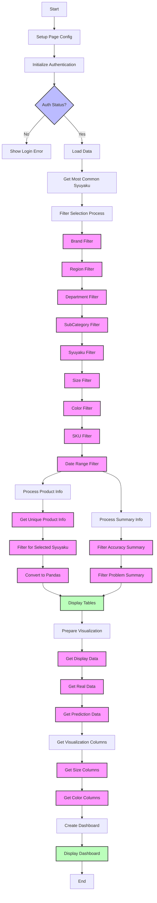
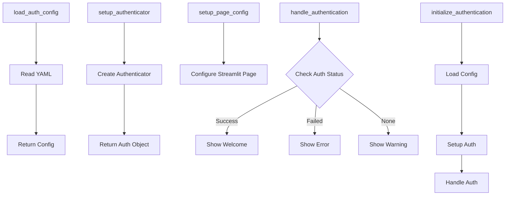
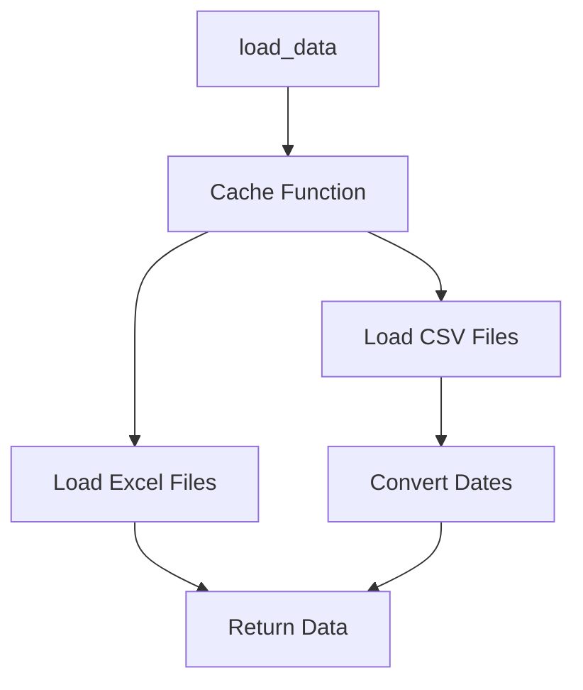
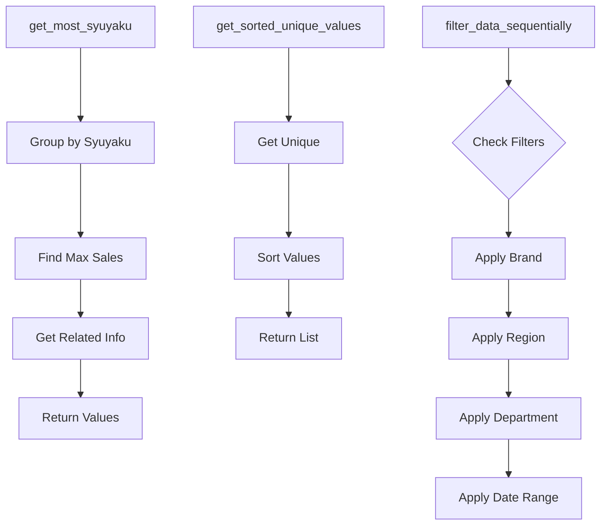
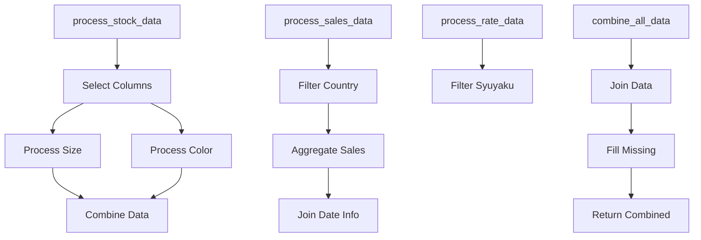
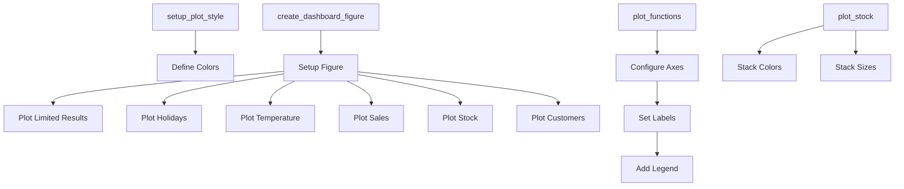

# Application Workflow

## Main Application Flow

## Module: auth_utils

## Module: data_loader

## Module: data_processor

## Module: data_transformer

## Module: visualizer

Each module's workflow shows its main functions and their interactions. The diagrams use:
- Process nodes for functions
- Decision nodes for conditional logic
- Arrows to show data/control flow